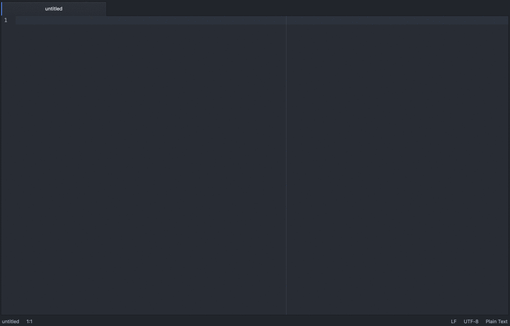

forcedotcom-builder
===================

Force.com builder for atom.io

This builder provides a simple wrapper for the ANT Migration tool provided by Salesforce, allows you to run your build.xml ant targets.  

## Features:

- Generate a new Force.com project structure
- Retrieve & Deploy force.com projects straight from Atom
- Create new Apex Classes, VF pages/components and Custom Labels
- Deploy single or multiple files
- Deploy only Apex Classes or Visualforce pages
- Create Custom Labels from Text Selection
